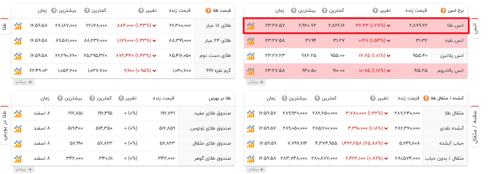
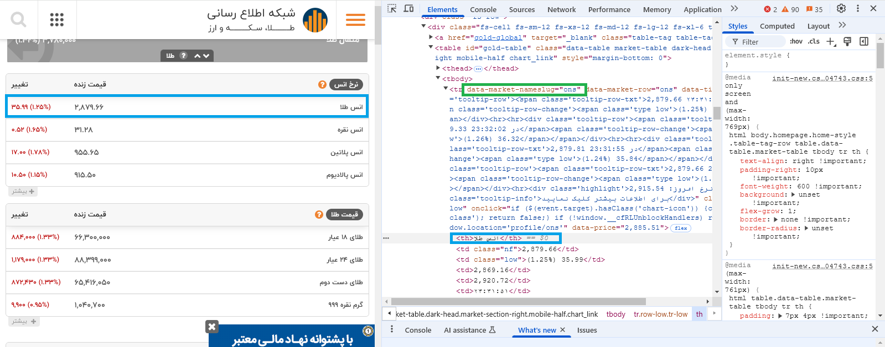

# شروع میکنیم به توضیح دادن
این اسکریپت برای دراوردن قیمت ها از سایت tgju هستش که برعکس خیلی از اسکریپت های نوشته شده که میان از api over http استفاده میکنن من از وبسوکت استفاده کردم که درواقع  قیمت هارو خیلی سریع تر بهمون برمیگردونه

## شروع کار
برای اینکه شروع کنید بهتره تمام پیش نیاز های خواسته شده توی requirements.txt نصب کنید اول تا اینکه اسکریپت بدون مشکل اجرا بشه و بعد از اون همونطور که از ریپو هم مشخصه ما یه چندتایی فایل هست که ما اول میریم سراغ اصل کار یعنی tgju.py که اصل کد هامون توی اینه خیلی خب

برای نصب پیش نیاز ها از requirements.txt
```bash
pip install -r requirements.txt
```
توی این فایل ما کلاس tgju داریم که همونطور که گفتم اصل کار  خب برای شروع شما اول باید یه کپی از این کلاس بسازین  مثل:
<br>


```python
metals=tgju()
```

خب بعد از اینکه ما شی خودمون ساختیم میایم  یه تابع با استفاده از async میسازیم 

```python
metals=tgju()

async def main():
    await metals.req()
    metals.is_jalali=True
    res=metals.extract_all()

    print(res)
```
توی خط اول با استفاده از متد req درخواست خودمون به مقصد میفرستیم 
توی خط دوم تاریخ خودمون تعریف میکنیم ایا جلالی باشه خب با مقدار True اگه نه False
و در اخر با استفاده از متد ()extract_multi میتونیم مشخص کنیم دقیقا تغییرات قیمت چی میخوایم برای مثال من خودم انس و نقره گذاشتم

البته متد دیگری هم هست به اسم ()extract_all که میاد تغییرات کل سایت میگیره 

```python

metals.extract_all()->#doesn't need parameters
metals.extract_multi(["ons","silver"])

```
در اخر متغیری به اسم res که همون result هستش نتیجه برمیگردونه که یه دیکشنری هستش 
نمونه:(از متد ()extract_all استفاده کردم)
```json
{'ons': {'name': 'ons', 'price': '2,914.01', 'high': '2,929.48', 'low': '2,891.23', 'rate': '0.09', 'dt': 'high', 'datetime': '1403-12-08 21:28:48'}, 'ratio_silver': {'name': 'ratio_silver', 'price': '91.38', 'high': '92.37', 'low': '91.23', 'rate': '0.76', 'dt': 'low', 'datetime': '1403-12-08 21:28:49'}, 'ratio_platinum': {'name': 'ratio_platinum', 'price': '2.98', 'high': '3.01', 'low': '2.93', 'rate': '0.3', 'dt': 'low', 'datetime': '1403-12-08 21:28:49'}, 'ratio_palladium': {'name': 'ratio_palladium', 'price': '3.13', 'high': '3.14', 'low': '3.06', 'rate': '0.52', 'dt': 'high', 'datetime': '1403-12-08 21:28:49'}, 'ratio_crudeoil': {'name': 'ratio_crudeoil', 'price': '42.37', 'high': '42.61', 'low': '41.83', 'rate': '0.64', 'dt': 'high', 'datetime': '1403-12-08 21:28:49'}, 'silver': {'name': 'silver', 'price': '31.89', 'high': '31.94', 'low': '31.42', 'rate': '0.85', 'dt': 'high', 'datetime': '1403-12-08 21:28:49'}, 'palladium': {'name': 'palladium', 'price': '929.25', 'high': '951.50', 'low': '926.00', 'rate': '0.59', 'dt': 'low', 'datetime': '1403-12-08 21:28:50'}, 'aluminium': {'name': 'aluminium', 'price': '2631.4', 'high': '2666.5', 'low': '2622.55', 'rate': '0.32', 'dt': 'low', 'datetime': '1403-12-08 21:28:51'}, 'general_3': {'name': 'general_3', 'price': '2631.4', 'high': '2666.5', 'low': '2622.55', 'rate': '0.32', 'dt': 'low', 'datetime': '1403-12-08 21:28:51'}}
```
## چطوری لیست چیزای که میخوایم پیدا کنیم؟
قدم اول اینکه به سایت tgju.org برید و از اونجا طبق مراحل زیر اسامی که نیاز دارید بردارید.



خب بعد از اینکه وارد سایت میشین میتونید اون چیزی که میخواین تغییرات قیمتش داشته باشین پیدا کنید برای مثال ما توی این مثال انس میخوایم خب با ابزار inspector خود مرورگر انتخابش میکنیم


بعدش همین مقدار توی data-market-nameslug میتونید استفاده کنید
## نکتات
### دربرخی موارد ارور تحت عنوان  529 میبینید که این ارور از طرف سرور سایت هست که اصولا به دلیل بار بالای ترافیک رخ میده
### ارور ها هم توی فایل err.log ثبت میشه